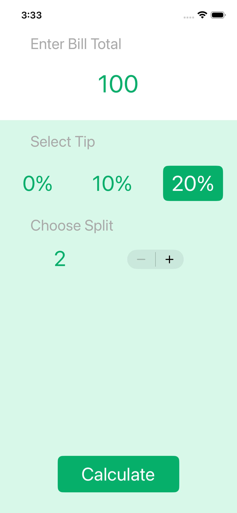
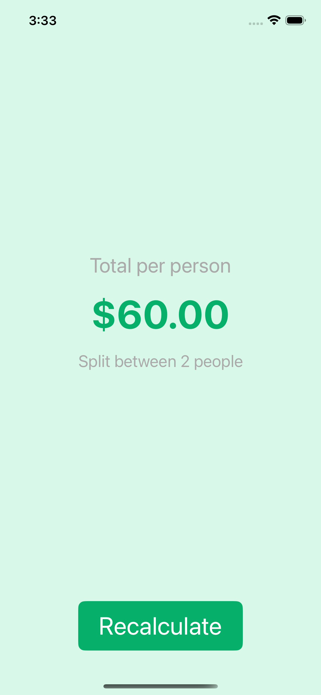

# Tipsy

A simple iOS tip calculator built with UIKit Programmatic.

Enter a bill total, choose a tip percentage, pick how many people to split between, and tap **Calculate** to see the amount per person.

## Screenshots

| Calculator | Results |
|---|---|
|  |  |

## Features

- Enter any bill amount
- Select tip: 0%, 10%, or 20%
- Split the bill between 2–25 people
- See the total per person instantly

## Requirements

- iOS 15.0+
- Xcode 14+

## Getting Started

1. Open `tipsy_akar.xcodeproj` in Xcode
2. Select a simulator or device
3. Press **Run** (⌘R)
